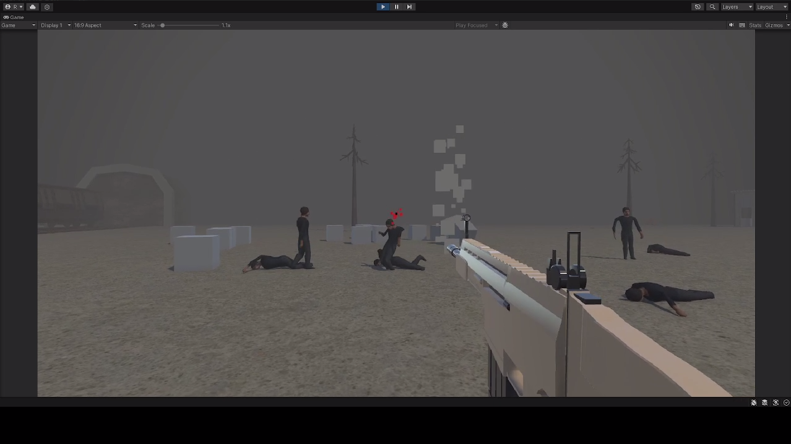
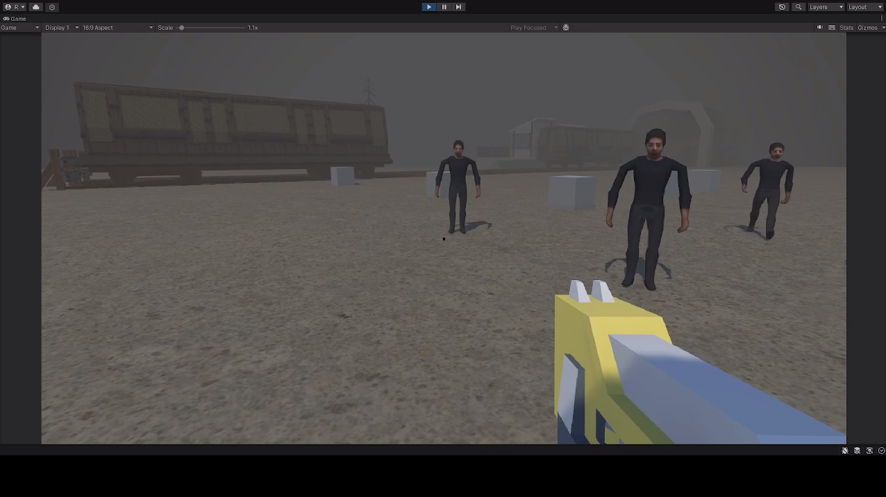
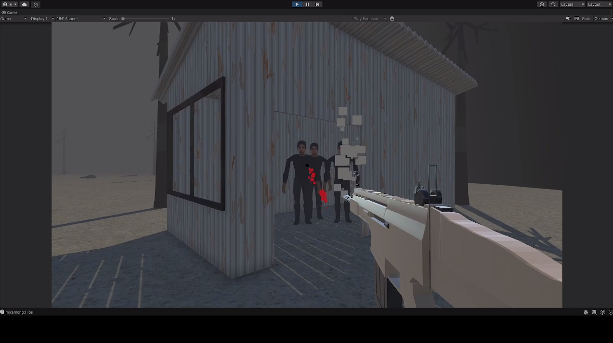
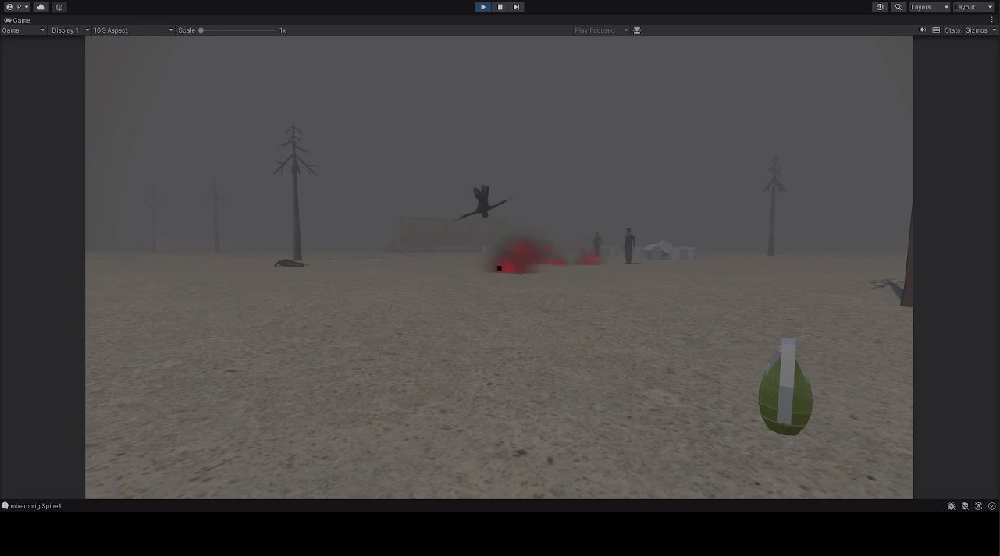
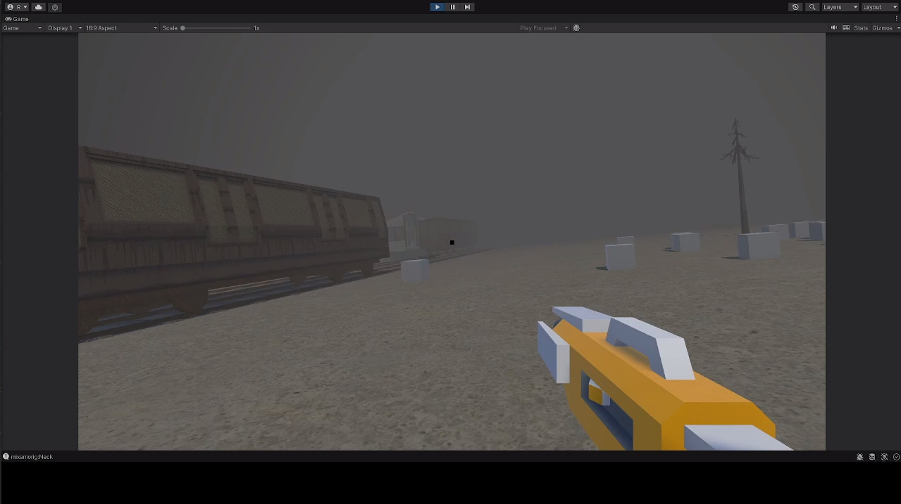

# Sandbox

Sandbox - игра, которую я разрабатывал несколько недель (не каждый день, но всё же). Вдохновлялся **GoreBox**, хотел сделать похожее, но для ЯИ

## Почему не дожила до релиза
В ходе разработки понимал, что архитектура проекта не удобная, костылей становилось много, в итоге: многократные исправления/переписывания с нуля в связке с большими перерывами, откладывали релиз. В конечном итоге, желания продолжать разработку уже не было

Это последствия того, что я хотел написать универсальное решение, без сильных зависимостей и костылей, не имея чёткого плана и с недостатком опыта

До того как я решил забросить, я переписывал пол проекта, так что текущая версия вряд-ли рабочая и при скачивании будет огромное количество ошибок в консоле. Времени прошло много, больше полугода, так что проще будет сделать заново, с чистого листа

Когда нибудь я вернусь к этому проекту (или новый в таком же жанре) и выпущу свою песочницу

## Что было сделано
* Динамичный контроллер персонажа
* Большое количество оружия (автоматы, потальная пушка, гранаты и т.д.)
* Инвентарь (Оружие, NPC, Nextbot)
* AI

## Скрины
Скрины были сделаны с видео, который был у меня в телеграмм канале, по этому качество оставляет желать лучше

